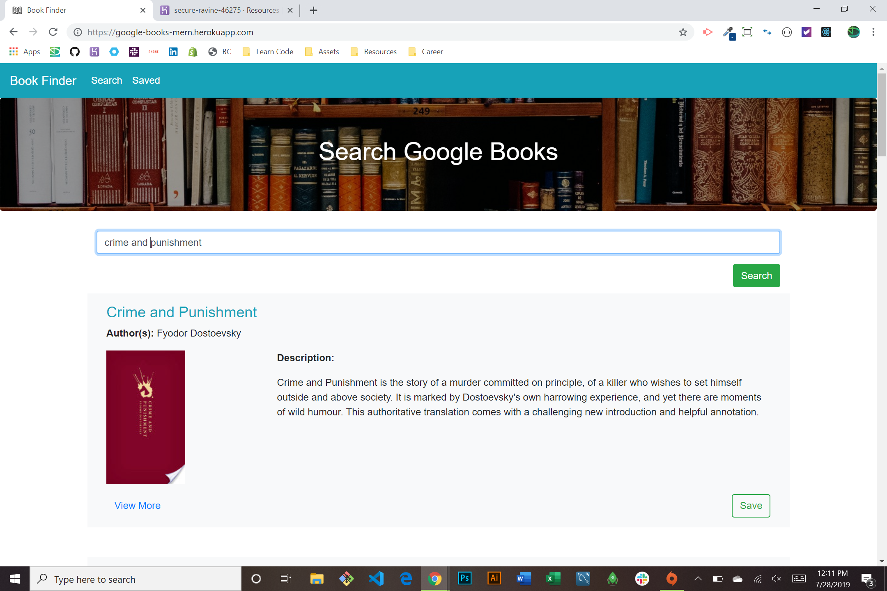

# Book Finder

### About this Project

Search through a large database of books with the help of the Google Books API. User inputs the title of a book and results are displayed below. They can then visit the google URL, save the book in a MongoDB database for later, or delete it from saved books.

  **Visit Web App [Here!](https://google-books-mern.herokuapp.com/)**

### Technologies used

* HTML
* CSS
* JavaScript
* React.js
* MongoDB
* Mongoose
* Google Books API
